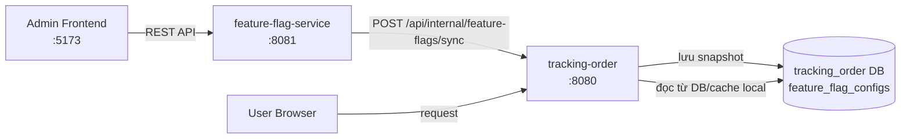

# 🚀 Feature Flag System — Workflow & Code Guide

## Tổng quan kiến trúc



> **Điểm mấu chốt:** Không có remote call nào xảy ra khi user đặt hàng. Tracking-order chỉ đọc **local DB** của chính nó.

---

## 📋 Workflow chi tiết

### PHASE 1 — Admin cấu hình flag

| Bước | Ai làm | Endpoint / Code | Mô tả |
|------|--------|-----------------|-------|
| 1 | Admin | `Frontend → PUT /api/v1/flags/{name}/toggle` | Bật/tắt flag toàn cục |
| 2 | Admin | `Frontend → PUT /api/v1/flags/{name}/strategy` | Gán strategy + param (nếu cần) |
| 3 | Admin | `Frontend → Customers tab` | Thêm customer với IP cụ thể |
| 4 | Admin | `Frontend → Manage Flags` | Bật/tắt flag riêng cho từng customer |
| 5 | Admin | `Frontend → Bấm Apply` | **Push toàn bộ config xuống tracking-order** |

---

### PHASE 2 — Apply: đẩy snapshot xuống tracking-order

**Trigger:** Admin bấm nút `Apply` trên frontend

```js
// App.jsx - Frontend gọi Apply
fetch('http://localhost:8081/api/v1/flags/apply', { method: 'POST' })
```

**Feature-flag-service** thu thập toàn bộ trạng thái:

```java
// FeatureFlagServiceImpl.java - applyToTrackingOrder()
public Map<String, Object> applyToTrackingOrder() {
    String version = Instant.now().toString();  // timestamp làm version

    // Thu thập tất cả flags từ Togglz
    List<Map<String, Object>> features = Arrays.stream(FeatureFlags.values())
            .map(flag -> toSnapshotFeature(flag, version))
            .toList();

    Map<String, Object> snapshot = Map.of("version", version, "features", features);

    // Gửi sang tracking-order
    String url = trackingOrderUrl + "/api/internal/feature-flags/sync";
    restTemplate.postForEntity(url, new HttpEntity<>(snapshot, headers), Map.class);
}
```

**Mỗi flag trong snapshot có dạng:**

```java
// FeatureFlagServiceImpl.java - toSnapshotFeature()
{
  "flagName":    "BUY_NOW",
  "enabled":     true,           // trạng thái global (từ Togglz DB)
  "strategyId":  "remote-client-ip",  // strategy đã chọn (nếu có)
  "strategyParams": { "ips": "192.168.1.10" },  // param strategy
  "customers": [                 // danh sách customer-level override
    {
      "customerCode": "CUST_001",
      "ipAddress":    "192.168.1.10",
      "enabled":      true,      // override riêng cho customer này
      "strategyId":   null,
      "strategyParams": {}
    }
  ],
  "version": "2026-08-10T..."
}
```

---

### PHASE 3 — Tracking-order nhận và lưu snapshot

```java
// InternalFeatureFlagController.java
@PostMapping("/sync")
public ResponseEntity<?> sync(
        @RequestHeader("X-Internal-Token") String token,
        @RequestBody FeatureFlagSyncRequest request) {

    if (!syncToken.equals(token)) {  // bảo mật bằng internal token
        return ResponseEntity.status(401).build();
    }
    int syncedRows = featureFlagConfigService.syncSnapshot(request);
    return ResponseEntity.ok(Map.of("syncedRows", syncedRows));
}
```

```java
// FeatureFlagConfigServiceImpl.java - syncSnapshot()
public int syncSnapshot(FeatureFlagSyncRequest request) {
    List<FeatureFlagConfig> configs = new ArrayList<>();

    for (FeatureFlagSyncItem feature : request.getFeatures()) {
        boolean globalEnabled = feature.getEnabled();
        List<CustomerFeatureSyncItem> customers = feature.getCustomers();

        if (customers == null || customers.isEmpty()) {
            // Không có customer rule → 1 row global
            configs.add(toConfig(feature, null, globalEnabled, version));
        } else {
            // Luôn thêm 1 row global làm fallback
            configs.add(toConfig(feature, null, globalEnabled, version));

            // Thêm row riêng cho từng customer (IP-specific)
            for (CustomerFeatureSyncItem customer : customers) {
                boolean customerEnabled = customer.getEnabled(); // độc lập với global
                configs.add(toConfig(feature, customer, customerEnabled, version));
            }
        }
    }

    featureFlagConfigRepo.deleteAllInBatch(); // xóa snapshot cũ
    featureFlagConfigRepo.saveAll(configs);   // lưu snapshot mới
}
```

**Kết quả trong bảng `feature_flag_configs`:**

| flag_name | enabled | customer_code | client_ip | applied_version |
|-----------|---------|---------------|-----------|-----------------|
| BUY_NOW | 1 | NULL | NULL | 2026-08-10T... ← global row |
| BUY_NOW | 1 | CUST_001 | 192.168.1.10 | 2026-08-10T... ← customer row |
| PRICE_INCREASE | 0 | NULL | NULL | 2026-08-10T... |

---

### PHASE 4 — User gọi API, tracking-order check flag

**Trigger:** User truy cập trang web, frontend gọi để check flag

```js
// Frontend tracking-order gọi
GET /api/v1/features/buy-now
```

```java
// FeatureController.java (tracking-order)
@GetMapping("/buy-now")
public ResponseEntity<Map<String, Boolean>> isBuyNowActive() {
    return ResponseEntity.ok(Map.of(
        "active", featureFlagClient.isEnabled("BUY_NOW")
    ));
}
```

```java
// FeatureFlagClient.java - chỉ đọc local, không gọi sang service khác
public boolean isEnabled(String flagName) {
    return featureFlagConfigService.isEnabled(flagName);
}
```

```java
// FeatureFlagConfigServiceImpl.java - isEnabled() - logic ưu tiên
public boolean isEnabled(String flagName) {
    List<FeatureFlagConfig> configs = featureFlagConfigRepo
            .findByFlagNameIgnoreCase(flagName);

    String clientIp = resolveClientIp(); // lấy IP từ HttpServletRequest

    // Tách row IP-specific vs global
    List<FeatureFlagConfig> ipRules    = configs có clientIp;
    List<FeatureFlagConfig> globalRules = configs không có clientIp;

    if (clientIp != null) {
        Optional<FeatureFlagConfig> ipMatch = ipRules.stream()
                .filter(c -> c.getClientIp().equals(clientIp))
                .findFirst();

        if (ipMatch.isPresent()) {
            return ipMatch.get().getEnabled(); // IP rule thắng
        }
    }

    // Không có IP match → dùng global row
    return globalRules.stream().anyMatch(c -> c.getEnabled());
}
```

---

## 🧠 Strategy vs Snapshot — Phân biệt 2 cơ chế

| | **Strategy (Togglz native)** | **Snapshot (luồng này)** |
|---|---|---|
| **Dùng khi nào** | Remote evaluation qua `/api/v1/flags/evaluate` | Tracking-order check cục bộ |
| **Context truyền như thế nào** | Client gửi `FeatureContext` trong request body | **Không cần** — đã lưu sẵn trong DB |
| **Ai check flag** | feature-flag-service (Togglz engine) | tracking-order (đọc local DB) |
| **Latency** | Có network call sang :8081 mỗi request | **Zero latency** — query local DB |
| **Phù hợp với** | Check phức tạp: role, profile, server name | Check đơn giản: IP, global on/off |

### Câu hỏi của bạn: *"Strategy+param nhưng không gửi context?"*

Đúng! Trong luồng Snapshot này:
- **Strategy & param** trong Togglz chỉ là metadata được **copy vào snapshot** (cột `strategy_id`, `strategy_params` trong `feature_flag_configs`)
- Nhưng tracking-order **KHÔNG dùng Togglz engine** để evaluate — nó tự đọc `enabled` + `client_ip` từ DB
- Strategy param hiện tại **chỉ được lưu để tham khảo**, chưa được tracking-order sử dụng để evaluate động

```
Admin set strategy "remote-client-ip" + param "192.168.1.10"
    ↓ Apply
Snapshot ghi: strategyId="remote-client-ip", strategyParams={"ips":"192.168.1.10"}
    ↓ NHƯNG
Tracking-order KHÔNG đọc strategyId/Params để check
Nó chỉ đọc: enabled=true + clientIp="192.168.1.10"
```

> **Customer-level override (Customers tab)** mới là cách đúng để control theo IP trong luồng này, vì IP được lưu trực tiếp vào cột `client_ip` của `feature_flag_configs`.

---

## 🔄 Toàn bộ luồng tóm tắt

```
1. Admin → bật BUY_NOW flag (global ON)
2. Admin → Customers tab → thêm CUST_001 (IP: 192.168.1.10)
3. Admin → Manage Flags → bật BUY_NOW cho CUST_001
4. Admin → Bấm Apply
        ↓
   feature-flag-service gom tất cả flags + customers
   gửi POST /api/internal/feature-flags/sync tới :8080
        ↓
   tracking-order xóa snapshot cũ, lưu snapshot mới:
   ┌──────────────────────────────────────────────┐
   │ BUY_NOW | enabled=1 | client_ip=NULL         │ ← global
   │ BUY_NOW | enabled=1 | client_ip=192.168.1.10 │ ← customer
   └──────────────────────────────────────────────┘
5. User 192.168.1.10 gọi GET /api/v1/features/buy-now
   → tìm thấy IP match → enabled=1 → trả về active=true ✅

6. User 10.0.0.5 gọi GET /api/v1/features/buy-now
   → không có IP match → dùng global row → enabled=1 → active=true ✅

7. Admin tắt BUY_NOW global → Apply
   → global row: enabled=0, customer row: enabled=1 (vẫn giữ nguyên)
   User 192.168.1.10 → IP match → enabled=1 → active=true ✅ (vẫn thấy)
   User 10.0.0.5 → global → enabled=0 → active=false ❌ (không thấy)
```
